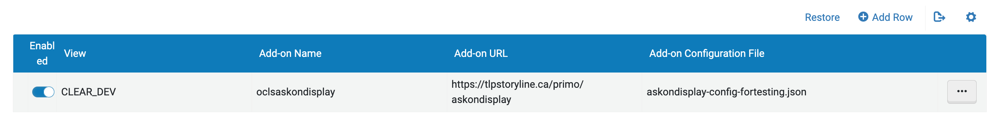

# askON custom libraryh3lp integration

Custom fork of [the Libraryh3lp NDE add-on](https://github.com/eebabe/PrimoVE-NDE-NubGames-LibraryH3lp)
for use by askON member libraries.

## How to enable the add-on

### Step 1: Download and customize settings file

Download the [`askondisplay-config.json` config file](add-on-config/askondisplay-config.json) and save it to your computer.

Edit the config file according to your needs:

Property | Effect
---------|-------
`queueName` | The name of the queue to be embedded in Primo. You can find it on the Queues Management page of the admin dashboard.
`snippetId` | The ID number of the chat snippet you'd like to use with Primo ("embedded" style recommended).
`queueNameProactive`| If you are using proactive chat, the name of the queue to be use in the proactive chat popup window.
`snippetIdProactive` | If you are using proactive chat, the ID number of the chat snippet for the proactive chat popup window. 
`skinIdProactive` |  If you are using proactive chat, the skin ID of the proactive chat snippet (found on the Queues Management page).
`proactiveChat` | Set this to `true` to turn on proactive chat. If you turn this on, be sure to provide the above three parameters as well.
`proactiveDelay` | If you are using proactive chat, set this to the number of seconds before the proactive chat popup appears.
`iconOnlineColor` | Custom tab colour when chat is online. Keep the default value `--sys-primary` to use theme colours.
`iconOfflineColor` | Custom tab colour when chat is offline. Keep the default value `--sys-surface-dim` to use theme colours.
`textOnlineColor` | Custom tab text colour when chat is online. Keep the default value `--sys-on-primary` to use theme colours.
`textOfflineColor` | Custom tab text colour when chat is offline. Keep the default value `--sys-on-surface` to use theme colours.
`iconPosition` | Use this parameter to move the chat tab relative to the **bottom right** corner of the page via a percentage value (e.g. "50%") or a specific pixel value (e.g. "200px").
`server` | The domain of the LibraryH3lp server where your subscription resides. askON members, use `ca.libraryh3lp.com`.
`offlineLink` | Set the URL to which users are redirected when they click on the chat tab outside of chat hours.

Refer to [the official Libraryh3lp documentation](https://ask.libraryh3lp.com/questions/33711#primove-nde) for more details.

Your file should look something like this:

```
{
	"queueName": "collegename",
	"snippetId": "1234",
	"queueNameProactive": "collegename-proactive",
	"snippetIdProactive": "5678",
	"skinIdProactive": "1234",
	"proactiveChat": true,
	"proactiveDelay": 10,
	"iconOnlineColor": "--sys-primary",
	"iconOfflineColor": "--sys-surface-dim",
	"textOnlineColor": "--sys-on-primary",
	"textOfflineColor": "--sys-on-surface",
	"iconPosition": "20%",
	"server": "ca.libraryh3lp.com",
	"offlineLink": "https://library.collegename.ca/contact-us"
}
```

### Step 2: Load the add-on

Log-in to your Alma back-end and navigate to **Configuration > Discovery > Other > Add-on Configuration**.

Select **Add row** and fill in the fields as follows:

* Activate Add-on: check this box
* Add-on Name: `oclsaskondisplay`
* Add-on Configuration File: select and upload the config file you edited in the previous step.
* View: Choose for which view(s) you want to enable the add-on, or **All**. This will only work on NDE views.
* Add-on URL: `https://tlpstoryline.ca/primo/askondisplay`

Click save and make sure the add-on is enabled on the list:



Refer to the [Exlibris official add-on documentation](https://knowledge.exlibrisgroup.com/Primo/Product_Documentation/020Primo_VE/Primo_VE_(English)/120Other_Configurations/Managing_Add-Ons_for_the_NDE_UI)
for more information.

## CSS customization

To customize the appearance of the AskON widget, you can override 
[any of the add-on CSS classes](src/app/libraryh3lp/libraryh3lp.component.scss) 
inside a Custom Package. See below for a few examples.

### Change the font of the askON tab

Add the following rule to your `custom.css` file:

```.css
.lh3-chat-label {
	font-family: "Times New Roman", Times, serif;
}
```

### Rotate the askON tab against the right-side border of the page

Add the following rule to your `custom.css` file:

```.css
.lh3-chat-widget {
	right: 0px;
	bottom: 50%; // Adjust vertical position according to your needs.
}

.lh3-chat-header {
	transform: matrix(-0.00,-1.00,1.00,-0.00,50,0);
}

.lh3-chat-frame-wrap {
	border: 1px solid var(--sys-primary);
}
```
Also be sure to set the `iconPosition` value to zero in your config file.

## Add-on development

The code in this repository builds on the [Primo NDE customModule](https://github.com/ExLibrisGroup/customModule) functionality from ExLibris, where more information
on development can be found.

To update the add-on after code changes:

#### 1. Install necessary npm packages

If not done before, inside the `customModule` directory run

```
npm install
```

#### 2. Make sure `buildsettings.env`    contains the following

```
INST_ID=OCLS
VIEW_ID=ASKONDISPLAY
ADDON_NAME=oclsaskondisplay
```

#### 3. Build the add-on

Inside the `customModule` directory, run

```
npm run build
```

This will generate a new directory named `OCLS-ASKONDISPLAY` inside the `dist` directory.

#### 4. Deploy the add-on

Copy the contents of `OCLS-ASKONDISPLAY` into the directory used for deployment. Be sure to **replace** all existing contents.

Changes will immediately be applied to all colleges that have enabled the add-on. Test to make sure changes were successful.

Refer to the [Primo NDE customModule](https://github.com/ExLibrisGroup/customModule) repository for more information on NDE add-on development.